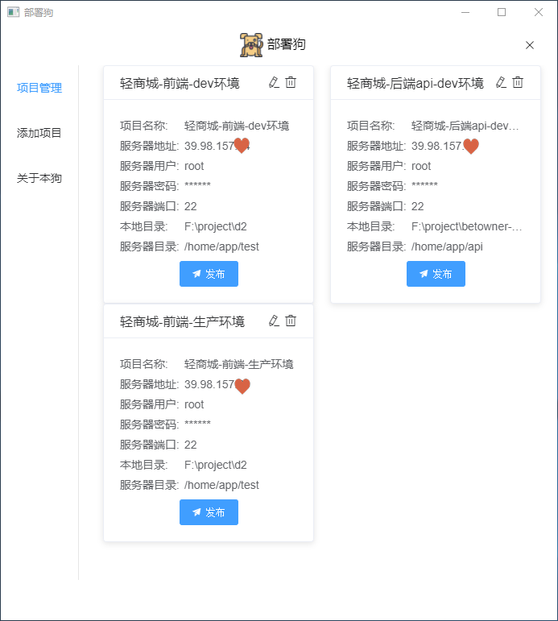
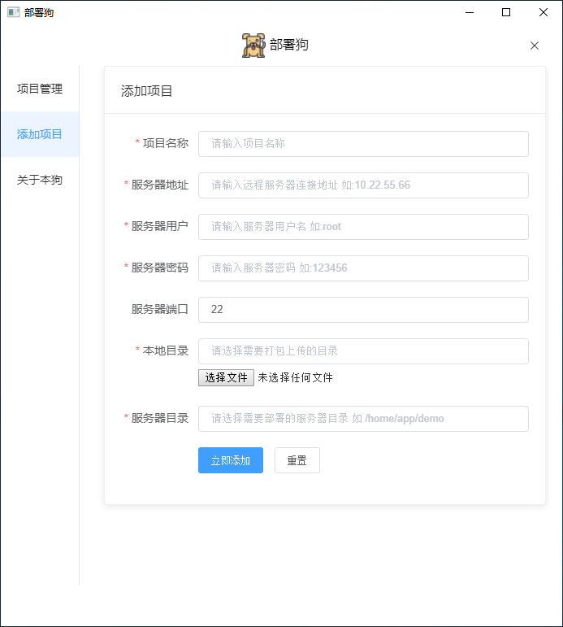
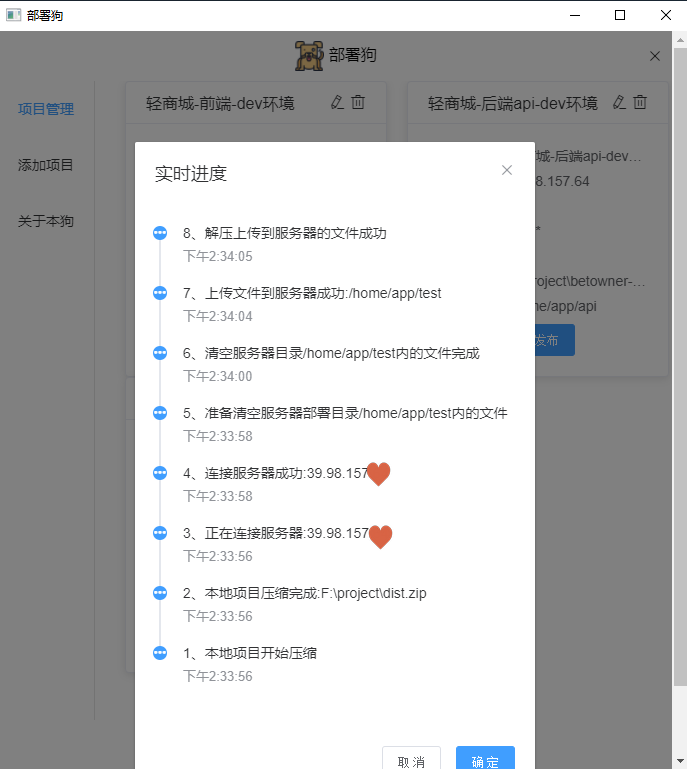
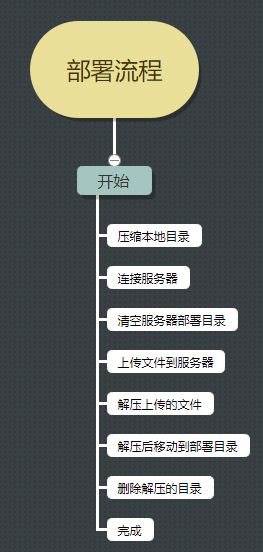

# 部署狗

- 适用与个人与小团队的轻量级自动部署工具
- 基于electron+vue+element开发

## :tada: 技术棧
- electron-vue

## :construction_worker: 开发
``` node
$ npm install
$ npm run dev
```

## :sparkles: screenshot

**项目管理**



**添加项目**



**发布进度**



## 部署流程



## :package: 安装包
[windows下载](https://github.com/RocWangPeng/deploy-dog/releases/tag/1.0.0)


## 具体代码：
- 部署代码 deploy.js (electron主进程中执行)
``` javascript
const path = require('path');
const node_ssh = require('node-ssh');
const zipFile = require('compressing')// 压缩zip

let SSH = new node_ssh(); // 生成ssh实例
let mainWindow = null; // 窗口实例,用于向向渲染进程通信

// 部署流程入口
const deploy = async (config, mainWindows) => {
    mainWindow = mainWindows
    await startZip(config);
    await connectSSH(config);
    await uploadZipBySSH(config)
}

//压缩代码
const startZip = async (config) => {
    return new Promise((resolve, reject) => {
        let { distPath } = config;
        let distZipPath = path.resolve(distPath, `../dist.zip`);
        mainWindow.send('deploy', '本地项目开始压缩')
        zipFile.zip.compressDir(distPath, distZipPath).then(res => {
            mainWindow.send('deploy', `本地项目压缩完成:${distZipPath}`)
            resolve()
        }).catch(err => {
            mainWindow.send('deploy', `压缩失败${err}`)
            reject()
        })
    })
}

//连接服务器
const connectSSH = async (config) => {
    return new Promise((resolve, reject) => {
        mainWindow.send('deploy', `正在连接服务器:${config.host}`)
        SSH.connect({
            host: config.host,
            username: config.username,
            password: config.password // 密码登录 方式二
        }).then(res => {
            mainWindow.send('deploy', `连接服务器成功:${config.host}`)
            resolve()
        }).catch(err => {
            mainWindow.send('deploy', `连接服务器失败:${err}`)
            reject()
        })
    })
}

//清空线上目标目录里的旧文件
const clearOldFile = async (config) => {
    mainWindow.send('deploy', `准备清空服务器部署目录${config.webDir}内的文件`)
    const commands = ['ls', 'rm -rf *'];
    await Promise.all(commands.map(async (item) => {
        return await SSH.execCommand(item, { cwd: config.webDir });
    }));
    mainWindow.send('deploy', `清空服务器目录${config.webDir}内的文件完成`)
}

//上传zip文件到服务器
const uploadZipBySSH = async (config) => {
    let distZipPath = path.resolve(config.distPath, `../dist.zip`);
    //线上目标文件清空
    await clearOldFile(config);
    try {
        await SSH.putFiles([{ local: distZipPath, remote: config.webDir + '/dist.zip' }]); //local 本地 ; remote 服务器 ;
        mainWindow.send('deploy', `上传文件到服务器成功:${config.webDir}`)
        await SSH.execCommand('unzip -o dist.zip && rm -f dist.zip', { cwd: config.webDir }); //解压
        mainWindow.send('deploy', `解压上传到服务器的文件成功`)
        await SSH.execCommand(`rm -rf ${config.webDir}/dist.zip`, { cwd: config.webDir }); //解压完删除线上压缩包
        mainWindow.send('deploy', `删除上传到服务器的文件成功`)

        //将解压后的文件夹内的所有文件移动到目标目录
        var dir = path.basename(path.join(config.distPath))
        mainWindow.send('deploy', `将${config.webDir}/${dir}/内解压的文件移动到目录${config.webDir}`)
        await SSH.execCommand(`mv - f ${config.webDir}/${dir}/*  ${config.webDir}`);
        await SSH.execCommand(`rm -rf ${config.webDir}/${dir}`); //移出后删除 dist 文件夹
        mainWindow.send('deploy', `全部完成`)
        SSH.dispose(); //断开连接
    } catch (error) {
        mainWindow.send('deploy', `文件上传到服务器失败:${error}`)
        // process.exit(); //退出流程
    }
}

export default deploy

```

- 主进程进行监听与渲染进行发送的命令
``` javascript
// 监听前台传来的deploy命令
ipcMain.on('deploy', (e, data) => {
  deploy(data, mainWindow)
});
```

- 前台部分代码
``` javascript
<template>
  <div id="wrapper">
    <el-row :gutter="20" class="pro-list">
      <el-col :span="12" v-for="(item, index) in dataList" :key="index">
        <el-card class="box-card">
          <ul class="prolist">
            <li>
              <span class="label">项目名称:</span>
              <span class="info">{{ item.projectName }}</span>
            </li>
            <li>
              <span class="label">服务器地址:</span>
              <span class="info">{{ item.host }}</span>
            </li>
        //    ...other
          </ul>
          <div class="btns">
            <el-button icon="el-icon-s-promotion" @click="deploy(item)" type="primary">发布</el-button>
          </div>
        </el-card>
      </el-col>
    </el-row>
  </div>
</template>

<script>
import { ipcRenderer } from "electron";
export default {
  name: "prolist",
  created() {
    this.getDb();
    // 接收主进程部署过程 中的 过程信息
    ipcRenderer.on("deploy", (event, arg) => {
      this.activities.unshift({
        content:arg,
        timestamp: new Date().toLocaleTimeString()
      });
    });
  },
  data() {
    return {
      dataList: [],
      activities: []
    };
  },
  methods: {

    // 部署
    deploy(config) {
    //   发送打包命令 给 主进程
      ipcRenderer.send("deploy", config);
    },
    remove(config) {
    //   删除项目
    }
  }
};
</script>
```

---

This project was generated with [electron-vue](https://github.com/SimulatedGREG/electron-vue)@[45a3e22](https://github.com/SimulatedGREG/electron-vue/tree/45a3e224e7bb8fc71909021ccfdcfec0f461f634) using [vue-cli](https://github.com/vuejs/vue-cli). Documentation about the original structure can be found [here](https://simulatedgreg.gitbooks.io/electron-vue/content/index.html).
